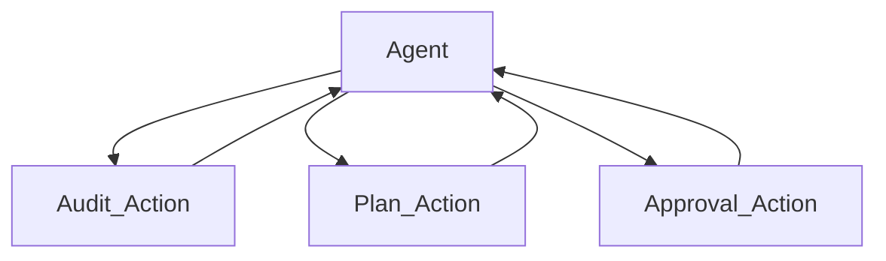

## Network Automation Assistant

### 📘  Overview

This LangGraph Studio project demonstrates an AI-powered assistant designed to streamline and automate the process of Cisco Nexus firmware upgrades. The agent intelligently audits firmware, gathers contextual information from ITSM systems, formulates a detailed upgrade plan, and submits it for approval. This project showcases the power of AI agents, tool usage, and iterative workflows in complex network operations, making it an excellent demonstration for presentations on Agent and Tool calls and iterative workflow capabilities.

Langgraph Studio URL [Link](https://smith.langchain.com/studio/thread?baseUrl=https%3A%2F%2Fclus25-demo03-v3-7cf65eeccbcd5e8c9f139d63da37a8a9.us.langgraph.app)
- Backup Langgraph Studio URL [Link](https://smith.langchain.com/studio/thread?baseUrl=https%3A%2F%2Fclus25-demo03-v3-7cf65eeccbcd5e8c9f139d63da37a8a9.us.langgraph.app)
> Please audit my datacenter networkaing environment for out of date firmware and provide a upgrade and change managment review.

### ✨ Features & Functions

This assistant leverages a stateful graph defined in agent.py to manage a multi-step workflow. It interacts with simulated external systems via tools defined in tools.py and is guided by a sophisticated system prompt and logic within nodes.py.

1. Intelligent Agent Core (nodes.py, agent.py):
   - Iterative Processing: The agent operates in a loop. It calls tools, processes their outputs, and the should_continue function (in nodes.py) determines the next step in the workflow. This allows for a dynamic, responsive process.
   - LLM-Powered Reasoning: Utilizes a Large Language Model (configurable for "anthropic" or "openai" as per GraphConfig in agent.py) to understand instructions from the system_prompt, process information from tools, and make planning decisions.
   - State Management (state.py): Employs AgentState to maintain the conversation history (messages) and other optional workflow-related data like devices, upgrade_plan, and approval_status as the process unfolds.
   - System Prompt Driven Behavior (nodes.py): A detailed system_prompt guides the agent through a specific sequence of operations, defines critical rules, and specifies the desired output format for the upgrade plan.

2. Workflow Steps & Tool Integration:
   - **Step 1: Firmware Audit (`FirmwareAudit` tool):**
      - The workflow begins with the agent node, which, guided by the `system_prompt`, determines the need to call the `FirmwareAudit` tool.
      - **Functionality:** This tool (simulated in `tools.py/audit_firmware()`) emulates querying a system like Cisco Nexus Dashboard. It identifies devices with outdated firmware and returns a JSON list containing device details, including current and recommended firmware versions.
      - **Graph Node:** `audit_action` in `agent.py`.

   - **Step 2: Contextual Data Gathering for Planning (`UpgradePlan` tool):**
      - After receiving the audit results, the agent calls the `UpgradePlan` tool, ensuring it passes the exact JSON output from the `FirmwareAudit` tool as the `devices_json` parameter.
      - **Functionality:** This tool (simulated in `tools.py/generate_upgrade_plan()`) emulates fetching rich contextual data from ITSM systems. It returns the original device list augmented with:
        -    `itsm_changemanagement_items`: Information on scheduled maintenance or change requests that might conflict with upgrades.
        -   `itsm_outage_items`: Details on current outages that could impact the upgrade process.
        -   `itsm_knowledgebase_items`: Relevant KB articles for specific device types or known issues.
      - **Graph Node:** `plan_action` in `agent.py`.

   -  **Step 3: AI-Driven Analysis & Plan Creation (Agent Reasoning):**
      - As mandated by the `system_prompt` (in `nodes.py`), the agent performs an in-depth analysis of the combined data from the `UpgradePlan` tool. This critical step utilizes the LLM's reasoning capabilities, not a separate tool.
      - **Analysis includes:**
        -   Cross-referencing each device against `itsm_changemanagement_items`.
        -   Checking for potential conflicts with `itsm_outage_items`.
        -   Noting relevant information from `itsm_knowledgebase_items` for each device or upgrade.
        -   Prioritizing devices: Spine devices are scheduled first, followed by Leaf devices.
        -   Scheduling maintenance windows: 2-hour windows for Spine devices, 1-hour windows for Leaf devices, ensuring upgrades are scheduled sequentially with no overlaps.
        -   Documenting clear reasons if any device cannot be upgraded due to conflicts or issues.
        - **Output:** The agent formulates a structured, comprehensive upgrade plan according to the "UPGRADE PLAN FORMAT" specified in the `system_prompt`.

   - **Step 4: ITSM Approval Submission (`ITSMApproval` tool):**
        -  Finally, the agent calls the `ITSMApproval` tool, providing the complete, structured upgrade plan it has created.
        - **Functionality:** This tool (simulated in `tools.py/request_itsm_approval()` using a Pydantic model `ITSMApprovalInput` for validation) emulates creating a change request or ticket in an ITSM system (e.g., ServiceNow, Remedy). It returns a submission status and a simulated ticket ID,             facilitating a human-in-the-loop approval process for the proposed changes.
        - **Graph Node:** `approval_action` in `agent.py`.

3. Critical Operational Rules & Workflow Control (enforced by system_prompt and graph logic):
   - The agent is strictly instructed to pass the COMPLETE JSON output from FirmwareAudit to the UpgradePlan tool.
   -  The UpgradePlan tool itself includes validation to ensure the devices_json parameter is not empty.
   - The detailed upgrade plan analysis and creation are explicitly designated as tasks for the agent's reasoning, not for additional tool calls.
   - The add_conditional_edges in agent.py uses the should_continue function to route the workflow based on the last tool called or to end the process. Edges then route back from tool actions to the agent node, enabling the iterative nature of the workflow.

### 🛠️ Self-Deployment Guide

To deploy this Network Automation Assistant yourself using LangSmith Platform, follow these steps:

Clone the Project: Clone the contents of this project folder (containing agent.py, nodes.py, tools.py, state.py, etc.) to your local machine. It's recommended to then push this project to your own Git repository (e.g., on GitHub, GitLab) for easier integration with LangSmith.

Obtain API Keys: You will need the following API keys. These should be set as environment variables in your LangSmith deployment environment or your local environment if testing locally.

ANTHROPIC_API_KEY: Required for using Anthropic's language models (e.g., Claude Sonnet). The nodes.py file is configured to potentially use Anthropic models, and call_model defaults to "anthropic" if no model is specified in the graph config.
OPENAI_API_KEY (Optional): If you plan to configure the agent to use OpenAI models (e.g., GPT-4o) as supported in nodes.py.
TAVILY_API_KEY (Optional, for future use): The tools.py file imports TavilySearchResults. While not used by the currently defined tools (firmware_audit_tool, upgrade_plan_tool, itsm_tool), this key would be necessary if you extend the project to include tools that leverage Tavily for web searches.
Deploy via LangSmith Platform:

Ensure your project (the cloned folder content) is in a Git repository accessible by LangSmith.
Navigate to your LangSmith account and follow the platform's documentation to deploy a new LangGraph agent or application from your Git repository.
During the LangSmith deployment configuration:
Point LangSmith to your repository and specify the main branch or file that exposes the compiled LangGraph (e.g., agent.graph from agent.py).
Set the necessary environment variables in your LangSmith deployment settings (e.g., ANTHROPIC_API_KEY, and OPENAI_API_KEY if you intend to use OpenAI models).
Once deployed, LangSmith will provide an endpoint or interface to interact with your agent.

### 🚀 Potential Expansions & Future Enhancements

The current project provides a robust foundation for a network automation assistant. Here’s how its features could be significantly expanded upon:

1. Real-World System Integration:
    - Live Data Sources:
    - Replace the simulated audit_firmware function with actual API calls to Cisco Nexus Dashboard, Cisco DNA Center, or other Network Management Systems (NMS) for real-time device discovery, inventory, and firmware status.
    - Modify generate_upgrade_plan to make live API calls to ITSM platforms (e.g., ServiceNow, Jira, Remedy) to fetch current change requests, incident data, and search enterprise knowledge bases.
    - Dynamic ITSM Ticketing: Enhance the ITSMApproval tool to not just submit a plan, but also to:
    - Poll the ITSM system for the approval status of the created ticket.
    - Update the ticket with progress or logs.
    - Potentially trigger subsequent workflow steps based on the ITSM ticket's state (e.g., "Approved", "Rejected").

2. Advanced Upgrade Planning & Automation Logic:
    - Automated Configuration Generation: Integrate tools or libraries (e.g., Jinja2 for templating, NAPALM for configuration rendering) to generate the precise, device-specific upgrade commands and, crucially, backout/rollback configurations.
    - Automated Pre- and Post-Upgrade Checks: Introduce new tools and agent logic to perform automated health checks on devices before and after the firmware upgrade. This could involve checking routing protocol adjacencies, interface statuses, hardware health, and custom validation scripts.
    - Automated Rollback Procedures: Develop tools and agent logic to trigger automated rollback procedures if post-upgrade checks fail or if critical issues are detected, using the pre-generated rollback configurations.
    - Sophisticated Scheduling & Resource Management:
    - Allow for more complex scheduling logic, factoring in business calendars, defined blackout periods, technician availability, or limited parallel upgrade capacity.
    - Implement more granular dependency mapping between network devices or services to ensure a safe and correct upgrade sequence beyond simple Spine/Leaf prioritization.
    - Risk Assessment: The agent could be enhanced to perform a more detailed risk assessment for each upgrade, factoring in device criticality, known bugs in target firmware, and historical stability.

3. Enhanced Human-in-the-Loop (HITL) Interaction:
    - True Pausing & Approval Gates: Modify the LangGraph workflow to genuinely pause execution and await an external human approval signal (e.g., via an API callback from the ITSM system after a change is approved, or a manual input step in a user interface) before proceeding with actual       
       execution steps (if added).
    - Interactive Plan Refinement: Provide a mechanism (perhaps via a UI or a specific conversational step) for network operators to review, modify, or annotate the AI-generated upgrade plan before it's submitted to ITSM or executed.

4. Direct Execution Capabilities (with extreme caution and robust safeguards):
    - Controlled Network Changes: For mature and well-tested environments, integrate tools like Ansible, Nornir, or pyATS to allow the agent (under strict human supervision and after explicit approval) to execute the upgrade commands on the network devices. This would require:
    - Comprehensive dry-run modes.
    - Atomic change implementation.
    - Extensive error handling and immediate alerting.

5. Broader Scope & Increased Intelligence:
    - Multi-Vendor/Platform Support: Extend the tools and agent logic to support firmware upgrades for other Cisco product lines (e.g., IOS-XE routers, ASA firewalls, WLCs) or even devices from other network vendors, requiring new tools and adapted prompts.
    - Adaptive Learning & Feedback Loops: Implement mechanisms for the agent to learn from the outcomes of past upgrades (e.g., duration, issues encountered, successful validations). This feedback could refine future planning, tool usage, or KB suggestions.
    - Proactive Maintenance Recommendations: Train the AI to analyze network trends, security advisories, and end-of-life announcements to proactively recommend firmware upgrades or other maintenance activities.

6. Improved Operability & User Experience:
    - Dedicated User Interface (UI): Develop a web-based UI (beyond LangGraph Studio) specifically for network operators. This UI would allow them to initiate workflows, view proposed plans, monitor progress, grant approvals, and review outcomes in a user-friendly manner.
    - Enhanced Logging, Auditing & Reporting: Provide more detailed, structured, and persistent logging for complete audit trails. Generate comprehensive reports on upgrade activities, success/failure rates, and compliance status.
    - Advanced Error Handling & Retry Mechanisms: Implement more sophisticated error detection within tools and agent logic, with options for automated retries for transient issues or clearer guidance for manual intervention.
    - Security Hardening: Integrate with enterprise secrets management solutions (e.g., HashiCorp Vault) for securely handling API keys and device credentials. Implement role-based access control (RBAC) to govern who can initiate, approve, or execute upgrade workflows.

This Network Automation Assistant project effectively demonstrates a significant step towards AI-augmented network operations. By building upon its current foundation, it can evolve into an even more powerful tool, promising substantial improvements in efficiency, reliability, and compliance for network maintenance tasks.
